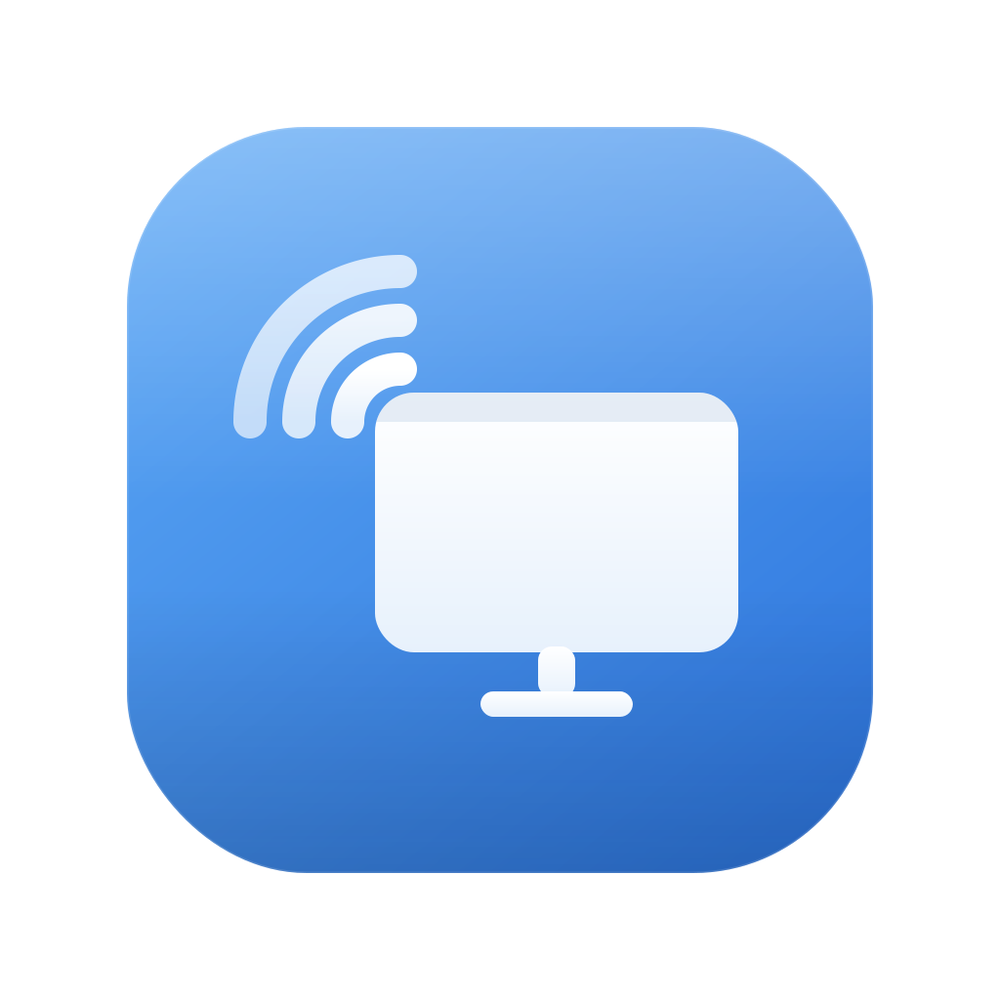
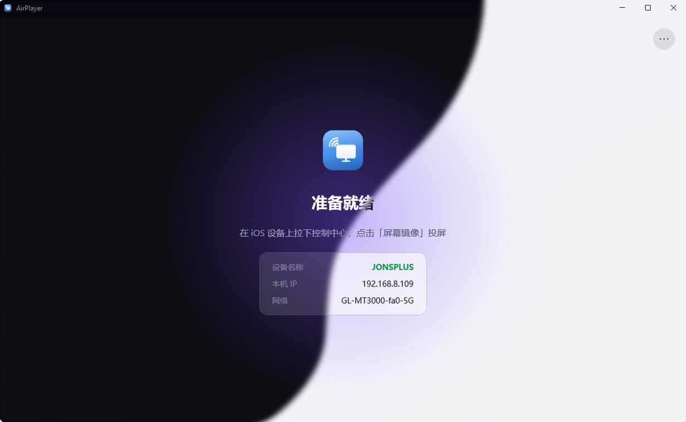

# AirPlayer

<p align="center">
  
</p>

<h3 align="center">AirPlayer</h3>

<p align="center">
  一个基于 .NET 8 + WinUI 3 构建的、全硬件加速且超低延迟的 Windows 端 AirPlay / AirTunes 接收端。
</p>

<p align="center">
  <a href="https://github.com/joyjoyfresh/Airplayer"></a>
  <a href="https://dotnet.microsoft.com/"></a>
  <a href="LICENSE"></a>
  
</p>

---

## 🌟 项目简介

**AirPlayer** 是一个专为 Windows 平台打造的 AirPlay 镜像接收端。通过高度优化的全 GPU 视频硬件解码渲染管线与低延迟音频同步方案，实现音画流畅同步的无线投屏体验。

> ⚠️ **本项目仅供学习与个人研究使用。** 本软件通过逆向工程实现 Apple 屏幕镜像协议，与 Apple Inc. 无任何隶属或背书关系。使用前请仔细阅读 [法律声明与免责条款](#-法律声明与免责)。

---

## 📸 界面预览

<p align="center">
  
</p>

<p align="center" style="font-size: 13px; color: #888;">
  想要查看更多风格的 Logo 设计与应用预览？请访问 <a href="branding/">branding/</a> 目录。
</p>

---

## ✨ 核心特性

- ⚡ **全 GPU 加速视频管线**：视频流（H.264）采用 Media Foundation 硬件解码，辅以 D3D11 Video Processor 进行色彩转换与缩放，通过 DXGI 翻转交换链呈现。低延迟、极低 CPU 占用，不支持硬解时自动回退软解。
- 🎵 **高保真音频同步**：音频流（AAC-ELD）使用 `fdk-aac` 解码并结合波形音频 API（waveOut）进行低延迟输出，配合有界音视频对齐缓冲机制实现音画同步。
- 🔄 **自适应旋转与热重置**：完美处理 iOS 设备横竖屏切换引发的分辨率剧烈变化，支持解码器与渲染链的热重置及错误自动恢复。
- ⚙️ **多维度自定义设置**：
  - 分辨率调节（支持 720p / 1080p 流接收）
  - 帧率上限控制（30 / 60fps）
  - 自定义音频输出设备选择
  - 窗口置顶、一键截图（可指定截图保存目录）
- 📊 **实时 HUD 诊断**：内置实时性能监视看板，直观展示当前投屏分辨率、帧率、硬件解码状态以及丢帧情况。

---

## 🖥️ 环境要求

- **操作系统**：Windows 10 Version 1809 (Build 17763) 或更高版本 / Windows 11（x64 架构）。部分高级视觉效果（如 Mica 材质）需要 Windows 11。
- **开发工具**：.NET 8 SDK，以及 Visual Studio 2022（需勾选「Windows 应用 SDK / WinUI 3」工作负载）。
- **音频依赖库**：`fdk-aac.dll` (x64) 动态链接库。

---

## ⚠️ 关于 fdk-aac.dll（音频解码必备）

iOS 投屏音频采用 **AAC-ELD**（低延迟高保真）编码。由于 Windows Media Foundation 和 FFmpeg 的内置解码器均不支持 ELD 变体，本项目依赖开源的 `fdk-aac` 库。

> [!IMPORTANT]
> 出于合规性与专利许可限制，本仓库**不直接分发** `fdk-aac.dll` 文件。您需要自行获取该文件，并在运行或打包前将其放置于 `AirPlayer.App\native\` 目录下。

### 获取方式（二选一）：

#### 方式一：使用内置一键下载脚本（推荐）
在项目根目录下通过 PowerShell 运行以下脚本，它将自动从 MSYS2 官方仓库拉取对应的 x64 dll 并放置到正确位置：
```powershell
powershell -ExecutionPolicy Bypass -File tools\get-fdk-aac.ps1
```

#### 方式二：通过 vcpkg 自行编译
如果您本地有 vcpkg 环境，可执行以下命令：
```powershell
# 编译 x64 版本的 fdk-aac
vcpkg install fdk-aac:x64-windows

# 将生成的 DLL 复制到 App 的 Native 依赖目录中
copy <vcpkg安装路径>\installed\x64-windows\bin\fdk-aac.dll AirPlayer.App\native\
```

*注：若未提供该动态库，视频投屏仍可正常工作，但音频将保持静音。*

---

## 🚀 构建与运行

1. 克隆本仓库到本地。
2. 确保已将 `fdk-aac.dll` 放置于 `AirPlayer.App\native\` 目录中。
3. 通过命令行构建并运行：

```bash
# 执行 x64 平台的构建
dotnet build Airplayer.sln -c Debug -p:Platform=x64

# 启动 AirPlayer.App
dotnet run --project AirPlayer.App
```

或者使用 Visual Studio 2022 打开 `Airplayer.sln`，设置 `AirPlayer.App`（x64 架构）为启动项，按 `F5` 启动调试。

> **如何投屏**：保持您的 iPhone/iPad 与运行本软件的 PC 在**同一局域网**内，打开 iOS 控制中心，点击“屏幕镜像”并选择您的电脑设备名称即可开始投屏。

---

## 📂 项目结构

- **AirPlayer.Protocol** (`net8.0` - 平台无关库)：
  - 核心协议实现层。包含了 mDNS 服务广播、RTSP 服务端、FairPlay 安全握手与 AES 解密逻辑。
  - `AirPlayReceiver` 作为对外入口，维护整个投屏会话的状态，并提供 H.264 视频帧与 PCM 音频帧的事件分发。
- **AirPlayer.App** (`net8.0-windows` - WinUI 3 桌面应用)：
  - 基于 C#/WinUI 3 的现代化客户端。
  - 负责 Direct3D 11 / DXGI 视频硬件解码与高效渲染管线搭建。
  - 音频基于多重缓冲 waveOut 播放，并实现各种交互界面与偏好配置菜单。

---

## 💾 数据存储与配置

应用的相关状态和用户配置将持久化保存在本地 `%LocalAppData%\AirPlayer\` 目录下：

- `settings.json`：存放用户设置（如分辨率、帧率限制、截图保存路径、HUD 开关等）。
- `identity.dat`：保存设备唯一的身份信息（MAC 地址 + ED25519 密钥对），以确保在重启后 iOS 设备识别到的仍为同一台 AirPlay 接收端。

> [!NOTE]
> 以上数据位于本地用户目录中，**不会且无需**提交到 Git 仓库。

---

## 📦 发布与打包

您可以使用内置的打包脚本快速生成独立运行的绿色包：
```powershell
powershell -ExecutionPolicy Bypass -File tools\build-release.ps1 -Version 1.1.2
```
打包成功后，将在 `publish\AirPlayer-1.1.2-win-x64\` 中生成免安装绿色版本（包含 exe 启动程序、所有依赖运行时以及自动嵌入的 `fdk-aac.dll`）。

---

## 🔍 诊断与日志

调试日志机制仅在 **Debug 编译模式**下生效，Release 模式下没有任何性能和文件读写开销：
- `AirPlayer.Protocol\airplay-video.log`：记录 RTSP 会话控制与视频解码渲染链路的相关日志。
- `AirPlayer.App\audio-debug.log`：记录音频播放缓冲区的状态日志。

---

## ⚖️ 法律声明与免责

- 本项目为一个**个人技术学习与研究**性质的开源实现，**不与 Apple Inc. 产生任何关联，亦未获得其任何明示或暗示的授权与背书**。
- “AirPlay”、“AirTunes” 等商标及相关技术知识产权归 Apple Inc. 所有。本项目提及此类名称仅出于客观描述兼容性之目的，不作商业宣传或品牌用途。
- 本项目兼容 AirPlay 协议所需的 FairPlay 配对机制与算法均参考了网络公开的逆向工程社区成果。因不同国家与地区的法律对于安全协议逆向、避开技术保护措施（DRM）等行为的合规性认定存在差异，**用户分发、复制或使用本软件的行为须自行承担全部法律风险**。
- 软件基于 “AS IS”（原样）原则提供，不附带任何担保。作者不对因使用本软件造成的设备损坏、数据丢失或合规纠纷承担任何责任。

---

## 🤝 致谢与第三方许可证

- **Fraunhofer FDK AAC**：用于高保真的 AAC-ELD 音频解码，遵循其自身的许可证。
- **AirPlay 开源社区**：向 RPiPlay、UxPlay、shairport 等优秀开源项目致敬，本项目在其架构思路和握手协议的逆向分析上获益良多。
- 依赖的开源类库：WinUI 3 (Windows App SDK)、Vortice.Windows (Direct3D11 / DXGI 绑定封装) 等。

---

## 📄 开源许可证

本项目原创部分代码采用 **[MIT](LICENSE)** 协议开源。其余引用的第三方组件与库分别遵守其原作者分发的授权协议。
